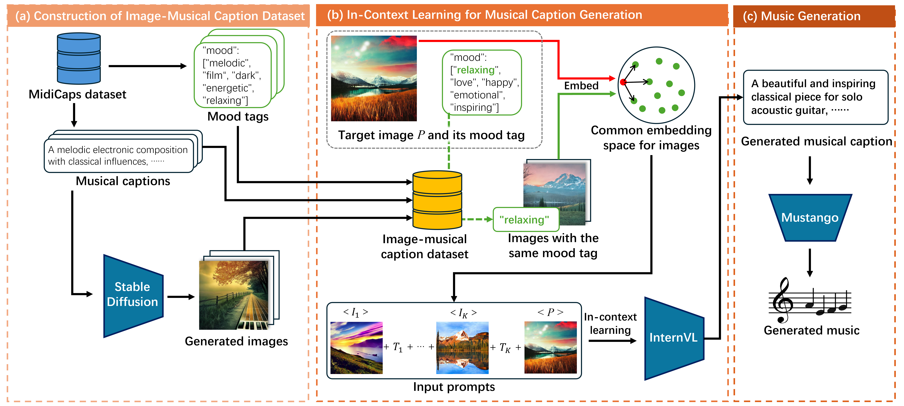

# Context-aware Image-to-Music Generation via Bridging Modalities through Musical Captions  
**Accepted Paper | ACMMM 2025**  
This repository provides the official implementation of our ACMMM 2025 paper on image-to-music generation using musical captions as cross-modal bridges. Our method leverages in-context learning with multi-modal LLMs to generate musically-grounded descriptions from images, which are then synthesized into high-quality music via a text-to-music diffusion model. The system enables automatic music generation that aligns with visual content's mood, scene composition, and semantic context without requiring musical expertise from users.

  

## Coming Soon...
